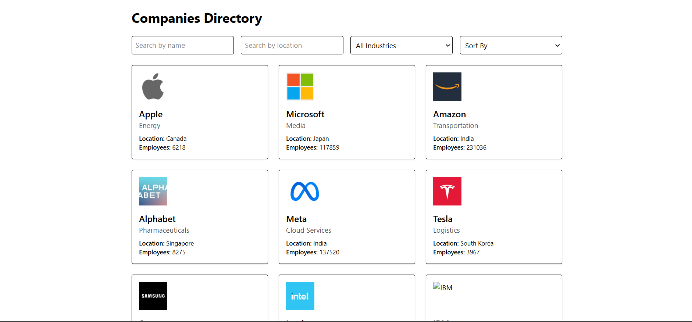

# 📘 Companies Directory App

A fully functional **Companies Directory Application** built using **Vite + React**, **Tailwind CSS**, and **JSON Server**.  
Users can search, filter, sort, and infinitely scroll through a large list of companies.  
Perfect for learning real-world full-stack patterns.

---

## 🚀 Features

### 🔍 Search & Filter

- Search by **name**
- Filter by **location**
- Filter by **industry** (dropdown)

### ↕ Sorting

- Sort by **company name**
- Sort by **location**
- Sort by **number of employees**

### ♾ Infinite Scrolling

- Loads companies automatically as the user scrolls
- Smooth user experience (no page reloads)

### 🎨 UI

- Built using **Tailwind CSS**
- Optional Material UI components
- Clean and responsive layout
- Company cards with logo, location, industry, and employees count

---

## 📁 Project Structure

src/
├── components/
│ └── Companies/
│ ├── index.jsx
│ └── index.css
├── App.jsx
└── main.jsx

---

## 🛠️ Tech Stack

- React (Vite)
- Tailwind CSS
- JSON Server (Mock API)
- JavaScript
- Material UI (Optional)
- Infinite Scroll Logic

---

# 📦 Installation & Setup

Follow these steps to run the project locally.

---

## ✅ 1. Clone the Repository

```bash
git clone https://github.com/your-username/companies-directory.git
cd companies-directory


```

2. Install Dependencies

npm install

✅ 3. Start the Mock API (JSON Server)

Install JSON Server if you don’t have it:

npm install -g json-server

API Endpoint:

http://localhost:3001/companies

4. Start the React App

npm run dev

Your app will run at:

http://localhost:5173


